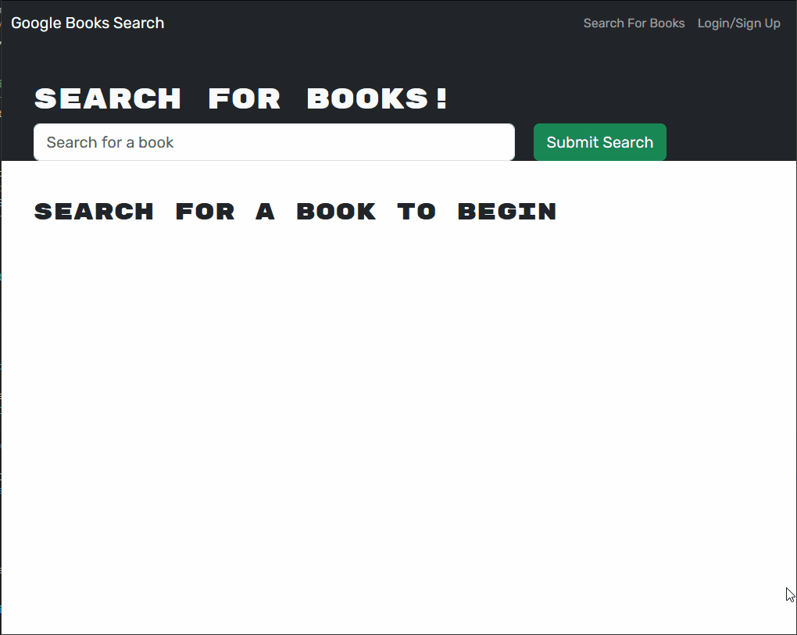

# Module-21-MERN-Book-Search-Engine

## Description

This is a simple website that lets you search for books using Google's API. And if you log in,
you can save a list of books to reference later. I didn't write most of that, however. My work here
was to convert this functionality from using a RESTful API to use Apollo and GraphQL. In an ideal world,
it'll work exactly like the starter code. 

## Usage

Visit https://boiling-hamlet-88886-3da5f82ca984.herokuapp.com/ and start saving books, today!

## Technologies Used

- React
- Express.js
- Node.js
- MongoDb
- Mongoose
- React Router
- GraphQL
- Apollo

## Lessons Learned
- It can be very frustrating when you need to change a lot of code, and are unable to test individual pieces
as you go. 
- If you try to assign a variable by referencing something that's undefined, it won't just give that variable the value
of undefined. It'll crash instead.

## Credits
- Starter code courtesy of https://github.com/coding-boot-camp/solid-broccoli